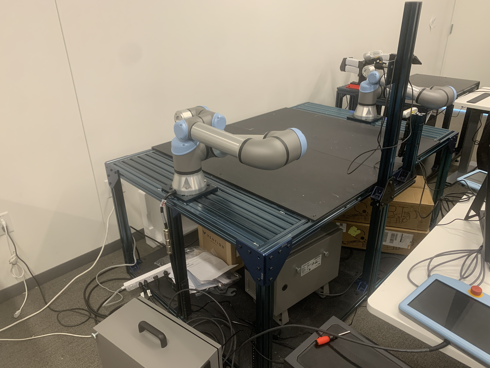
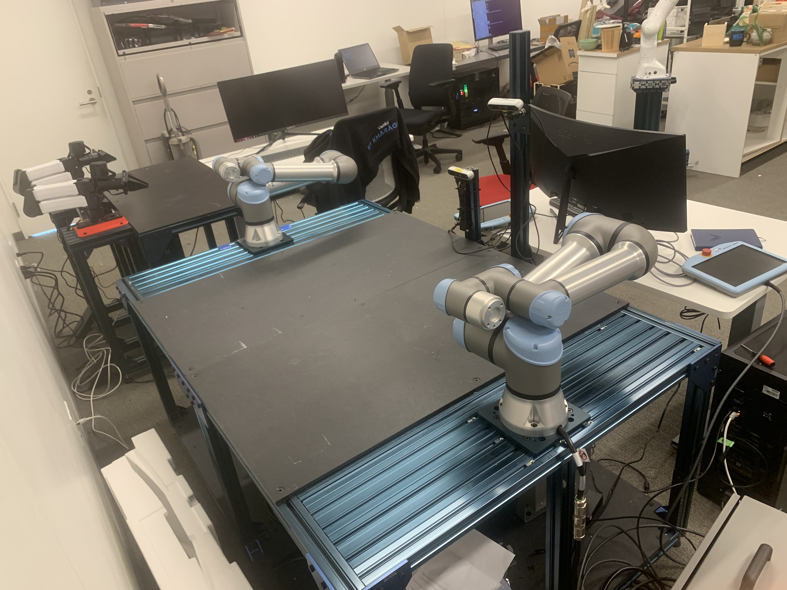

# Bimanual UR7e Table — Setup Specs

## Reference photos

"Front", "right", and "left" are from the perspective of someone standing **near
the cameras** looking at the table.

## Raw measurements

Table:
- 76 cm table height (top of the aluminum frame, before the board)
- 1.5 cm board thickness (black board stacked on top of the aluminum table)
- 114 cm width
- 172.5 cm length

Arm base:
- 56.5 cm from the front edge (~= centered in the 114 cm width)
- 12 cm distance of arm from edge of table (the short left/right end edge)
- 0.6 cm Vention plate thickness under the robot arm

Cameras (Intel RealSense D435):
- **Camera 1:** 25.5 cm height *from the board* (not the table height); 65 cm from
  the right edge; 3.7 cm from the front edge.
- **Camera 2:** 52 cm height from the board; 74.5 cm from the left edge; 10 cm from
  the front edge.

## Model coordinate frame (as built in `build_urtable.py`)

Origin at the **center of the table footprint, on the floor (z = 0)**.
- **+x** = to the **right** (right edge at x = +0.8625 m, left edge at −0.8625 m).
- **+y** = toward the **back**, away from the cameras (back edge at y = +0.57 m,
  front edge at −0.57 m).
- **+z** = up.

The cameras lie along the long (172.5 cm) front edge — that's the only assignment
consistent with "65 cm from right" + "74.5 cm from left" both fitting on one edge
(65 + 74.5 = 139.5 < 172.5). So **left–right runs along the 172.5 cm length** and
**front–back runs along the 114 cm width**.

Heights:
- Aluminum frame top: z = 0.76 m
- Black board: 0.76 → 0.775 m, **cut around each plate**
- Blue Vention plate: bolts to the aluminum frame, 0.76 → 0.766 m
- UR7e base mounts at z = 0.766 m

Both arms start reaching inward over the board toward each other (shoulder_pan = 0),
upper arm angled up and forearm extended out over the table with the flange pointing
down: qpos = [0, −65°, 65°, −90°, −90°, 0°].

## Derived positions (meters)

Cameras:
- Camera 1: x = +0.8625 − 0.65 = **+0.2125**, y = −0.57 + 0.037 = **−0.533**,
  z = 0.775 + 0.255 = **1.030**
- Camera 2: x = −0.8625 + 0.745 = **−0.1175**, y = −0.57 + 0.10 = **−0.470**,
  z = 0.775 + 0.52 = **1.295**

## Arm placement (derived)

Both arms are **centered in the width** (56.5 cm from the front edge ≈ width/2),
**12 cm in from each short end edge**, and face each other along the length:
- Left arm:  (x = −0.7425, y ≈ −0.005), faces +x
- Right arm: (x = +0.7425, y ≈ −0.005), faces −x

## ASSUMPTIONS — please confirm / correct

These are not fully pinned down by the numbers above; I picked what matches the
photos and noted them so they're easy to fix:

1. **"12 cm from edge"** is interpreted as distance from the short (left/right)
   **end** edges, placing the two arms near opposite ends. The two arms are
   mirrored through the table center.
2. **Camera aim:** both cameras point at the table-center work surface (0, 0, 0.775).
3. **Camera FOV:** fovy ≈ 42° (D435 color vertical FOV). D435 body modeled as a
   90 × 25 × 25 mm box.
4. Table legs / lower frame modeled as plain extrusion boxes for visual context.
